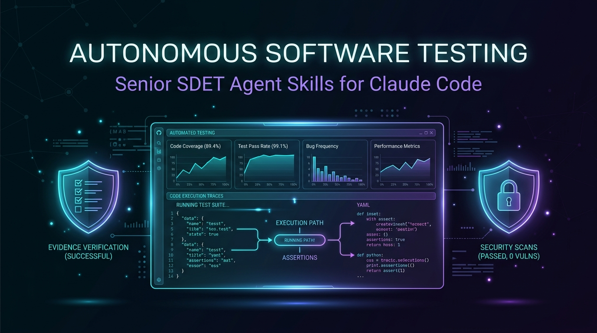
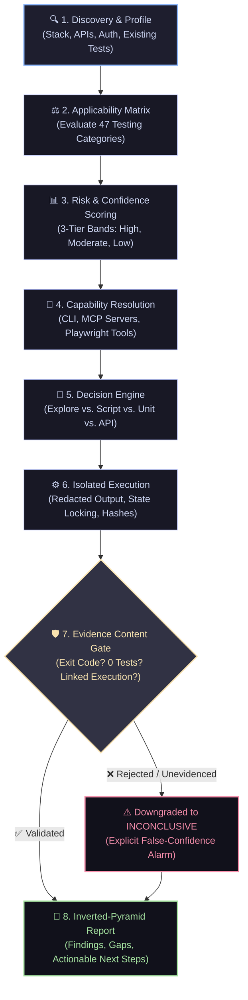

<p align="center">
  
</p>

<p align="center">
  <strong>An evidence-driven, extensible autonomous software testing agent skill system for Claude Code.</strong><br>
  <em>Tests software the way a senior SDET would: work out what is worth testing, prove what you find, and be precise about what you did not do.</em>
</p>

<p align="center">
  <a href="https://nodejs.org"></a>
  <a href="#as-a-claude-code-plugin"></a>
  <a href="https://playwright.dev"></a>
  <a href="https://github.com/Purushotham-Prajapati-24/qa-skills/actions"></a>
  <a href="evaluation/README.md"></a>
  <a href="LICENSE"></a>
</p>

---

> [!IMPORTANT]
> ### 🛡️ The Core Philosophy
> **`"I did not observe a failure" is not "it works."`**
> 
> Testing an agent by asking *"did the test suite pass?"* measures the software under test, not the agent's competence. A green test run that asserts nothing or skips critical paths is worse than a failed one. This framework measures the agent's **judgement**, its **honesty**, and the **verifiable evidence** behind every claim.

---

## ⚡ Instant Setup (One Command)

Install directly into **any repository** on any computer — no clone, no `npm install`, zero external runtime dependencies:

```bash
npx --yes github:Purushotham-Prajapati-24/qa-skills
```

Then in Claude Code, invoke your autonomous testing suite:

```text
"Test this repository."
```

<details>
<summary><b>🎯 Targeted Workflows & Prompts (Click to expand)</b></summary>
<br>

* 🔍 **Pull Request Testing**: *"Test PR #412 for security and regression risks."*
* 🌐 **Browser Exploration**: *"Explore the checkout flow for UI bugs and generate automated regression specs."*
* 📋 **Requirements & Planning**: *"Read SHOP-412 and create a risk-weighted test implementation plan."*
* ⚡ **Session Recovery**: *"Continue the previous testing session."*
* 📊 **Gap Analysis**: *"What remains untested in this repository?"*

</details>

---

## ✨ Why Autonomous Software Testing?

<table>
  <tr>
    <td width="50%" valign="top">
      <h3>🛡️ Zero False Confidence</h3>
      <p>A claim of <code>PASSED</code> without attached, hashed execution evidence is mechanically downgraded to <code>INCONCLUSIVE</code>. Non-zero exit codes and empty test suites (0 ran) are instantly rejected.</p>
    </td>
    <td width="50%" valign="top">
      <h3>🧠 Deterministic Decision Engines</h3>
      <p>47 testing categories evaluated against mathematical applicability matrices, 15-factor browser decision algorithms, and 3-tier risk confidence bands.</p>
    </td>
  </tr>
  <tr>
    <td width="50%" valign="top">
      <h3>🔐 Guarded External Writes</h3>
      <p>Destructive actions, issue filing, and PR transitions require explicit, per-session user authorisation, single-use delegated tickets, and independent <code>gh</code> read-backs.</p>
    </td>
    <td width="50%" valign="top">
      <h3>⚡ Pure Zero-Dependency Architecture</h3>
      <p>Lightning-fast native Node.js ESM. Includes atomic cross-process file locking (<code>wx</code> flag) and natural sorting (<code>DEC-100000</code> vs <code>DEC-99999</code>) for bulletproof subagent concurrency.</p>
    </td>
  </tr>
</table>

---

## 🔄 The Autonomous Testing Lifecycle

The system operates across a structured, multi-stage pipeline designed to eliminate hallucinations and blind assumptions:



---

## 🏛️ Architecture: Bookkeeping as Code, Judgement as Prose

> **Bookkeeping done by LLM judgement drifts. Judgement encoded as rigid code becomes an inflexible checklist bot.**

This system strictly separates mechanical bookkeeping from expert human/agent judgement:

```
┌────────────────────────────────────────────────────────┐
│                      CLAUDE CODE                       │
│    Reasoning, Semantic Exploration & Strategy (Prose)   │
└───────────────────────────┬────────────────────────────┘
                            │ Capabilities / CLI Calls
┌───────────────────────────▼────────────────────────────┐
│                    NODE ENGINE RUNTIME                 │
│       Deterministic Bookkeeping & Verification (Code)  │
│                                                        │
│  • Session State & Atomic Locking  • Evidence Hashing  │
│  • 47-Category Applicability       • Schema Validation │
│  • Risk Confidence Bands           • External Ledger   │
└────────────────────────────────────────────────────────┘
```

| 💻 Code Layer (`bin/ast.mjs`, `engine/`) | 🧠 Judgement Layer (`skills/`, `agents/`) |
|---|---|
| 🏷️ **Deterministic IDs & Schema Checks** | 🎯 **Deciding what is worth testing** |
| 🛡️ **Evidence Verification Gates** | 🔎 **Interpreting semantic diffs** |
| 🔒 **Atomic Concurrency & File Locks** | ⚖️ **Judging whether an anomaly is a defect** |
| 📖 **Independent Read-Back Confirmation** | 🌊 **Choosing depth and exploration trade-offs** |

*Read the comprehensive design: [ARCHITECTURE.md](ARCHITECTURE.md).*

---

## 🛡️ The Three Non-Negotiable Rules

```
 ┌────────────────────────────────────────────────────────────────────────┐
 │ 1. NO CLAIM WITHOUT EVIDENCE                                           │
 │    Claiming PASSED without supporting execution evidence automatically │
 │    downgrades to INCONCLUSIVE. Non-zero exit codes contradict PASSED.  │
 ├────────────────────────────────────────────────────────────────────────┤
 │ 2. NO EXTERNAL WRITE WITHOUT EXPLICIT AUTHORISATION                    │
 │    Filing issues, mutating tickets, or running destructive commands    │
 │    requires per-session approval and independent read-back proof.      │
 ├────────────────────────────────────────────────────────────────────────┤
 │ 3. A BLOCKER STOPS ONE BRANCH, NEVER THE SESSION                       │
 │    Missing credentials? Mock boundaries, mark that scenario BLOCKED,   │
 │    and continue validating all other test categories.                  │
 └────────────────────────────────────────────────────────────────────────┘
```

---

## 📦 Installation Guide

### Option 1: Repository Scope (Default & Recommended)
Installs cleanly into `.claude/` in the active project directory:
```bash
npx --yes github:Purushotham-Prajapati-24/qa-skills
```

```text
.claude/
  ├── skills/    # 21 domain-specific skills loaded on-demand
  ├── agents/    # 4 dedicated subagents for heavy context
  └── ast/       # Zero-dependency Node runtime, CLI, engines & schemas
```

### Option 2: Workstation Scope (User-Wide)
Make skills available to every repository on your machine:
```bash
npx --yes github:Purushotham-Prajapati-24/qa-skills --user
```

### Option 3: Claude Code Plugin Marketplace
Install directly as a plugin bundle:
```bash
/plugin marketplace add https://github.com/Purushotham-Prajapati-24/qa-skills
/plugin install autonomous-software-testing
```

<details>
<summary><b>⚙️ Advanced Installation Flags (Click to expand)</b></summary>
<br>

```bash
# Pin to a specific tagged release
npx --yes github:Purushotham-Prajapati-24/qa-skills#v0.10.0

# Dry-run inspection (see what files change without writing)
npx --yes github:Purushotham-Prajapati-24/qa-skills --dry-run

# Partial install (only the skills you need)
npx --yes github:Purushotham-Prajapati-24/qa-skills --only unit-testing,api-testing,browser-testing

# Wire safety hooks into .claude/settings.json
npx --yes github:Purushotham-Prajapati-24/qa-skills --hooks

# Force reinstallation (overwrites existing files)
npx --yes github:Purushotham-Prajapati-24/qa-skills --force
```

</details>

---

## 🧩 The 21 Specialist Skills & 4 Subagents

```
skills/
├── 🎯 Orchestration & Discovery
│   ├── 🧭 testing-orchestrator       Loop governance, lifecycle policies, and recovery
│   ├── 🔍 repository-intelligence    Stack profiling, config mapping, and test discovery
│   ├── 📈 change-intelligence        Git diff analysis, churn scoring, and blast radius
│   ├── 📝 requirement-analysis       User story extraction, acceptance criteria & gaps
│   ├── ⚖️ risk-analysis              Risk engine scoring with 3-tier confidence bands
│   └── 🗺️ test-strategy              Coverage budgeting, category pruning & test plans
│
├── 🧪 Execution Specialists
│   ├── 📦 unit-testing               Harness baselining, isolation, and mutation checks
│   ├── 🔗 integration-testing        Subsystem boundaries, contract checks, and mocks
│   ├── 🌐 api-testing                REST/GraphQL contracts, boundary cases & schemas
│   ├── 🗄️ database-testing           Migrations, idempotency, seed data, and rollbacks
│   ├── 🎭 browser-testing            Playwright script authoring & browser-decision engine
│   ├── 🖥️ ui-testing                 DOM interactions, state transitions, layout regressions
│   ├── 🚀 e2e-testing                Multi-step golden user paths and transactions
│   ├── 🔁 regression-testing         Safety nets, change-focused test selection
│   ├── ♿ accessibility-testing      axe-core audits, WCAG compliance, keyboard traps
│   ├── 🔒 security-testing           Auth bypass, IDOR, input sanitation, secret exposure
│   ├── ⏱️ performance-testing        Endpoint latency baselines, queries, and N+1 leaks
│   ├── 💻 compatibility-testing      Node versions, environments, OS differences
│   └── 🤖 ai-testing                 Prompt regression, determinism checks, model drift
│
└── 📋 Analysis & Delivery
    ├── 🐛 defect-reporting           Fingerprinted, reproducible defect reports
    └── 📑 test-reporting             Inverted-pyramid executive & technical summaries
```

### 👥 Dedicated Context Subagents
For tasks that would flood the primary conversation window, the orchestrator delegates to specialized subagents:
* 🕵️ **`repository-analyst`**: Static analysis, AST extraction, and dependency graph mapping.
* 🌐 **`browser-explorer`**: Interactive exploratory browser navigation and DOM verification.
* ✍️ **`test-author`**: Authoring idiomatic, maintainable test files tailored to local conventions.
* 🛡️ **`evidence-auditor`**: Independent verification of hashes, epistemic classes, and exit codes.

---

## 🧠 Core Decision Engines

### 🎭 1. The Browser Decision Engine
Blindly defaulting to an interactive browser MCP wastes tokens and leaves zero regression assets. The engine balances **15 factors** across **5 distinct strategies**:

```text
Factors (Repeatability, UI Maturity, CI Gates, Cost)
                    │
                    ▼
┌────────────────────────────────────────────────────────┐
│                 BROWSER DECISION MATRIX                │
├────────────────────────────────────────────────────────┤
│ • playwright-script : Fast, deterministic CI assets    │
│ • playwright-mcp    : Interactive exploration of new UI│
│ • hybrid            : Explore via MCP, automate script │
│ • existing-suite    : Run repo's existing browser tests│
│ • do-not-test       : Omit if purely backend / cosmetic│
└────────────────────────────────────────────────────────┘
```
*Full policy: [skills/browser-testing/browser-decision.md](skills/browser-testing/browser-decision.md).*

### 📊 2. Risk Scoring & Confidence Bands
A risk score without a confidence metric is dangerous false precision:
* **Confidence Bands**: Assesses the share of weighted factors supported by evidence:
  * 🟢 **High** ($\ge 66\%$): Robustly evidenced across all risk vectors.
  * 🟡 **Moderate** ($33\% - 65\%$): Qualified risk level; highlights unevidenced assumptions.
  * 🔴 **Low** ($< 33\%$): Explicit warning; prevents using the score to exclude test categories.

### 🔬 3. Commit-Aware Flakiness Detection
* **Single Commit**: Mixed test outcomes on the exact same commit hash prove **test flakiness**.
* **Multiple Commits**: Mixed outcomes across commit boundaries indicate **behavioral regressions**.
* **Unrecorded Commit**: Demands commit recording rather than fabricating flakiness conclusions.

---

## 💻 Zero-Dependency CLI Cheat-Sheet (`ast`)

```bash
# ─── SESSION & LIFECYCLE ────────────────────────────────────────────────────────
node bin/ast.mjs session resume            # Inspect & resume an in-progress session
node bin/ast.mjs caps probe                # Probe local environment & providers
node bin/ast.mjs caps declare <p> <bool>   # Declare agent-available MCP tools

# ─── DECISION & REASONING ───────────────────────────────────────────────────────
node bin/ast.mjs risk score --explain      # Calculate weighted risk & confidence band
node bin/ast.mjs applicability eval        # Compute 47-category applicability matrix
node bin/ast.mjs browser decide            # Solve optimal browser testing approach
node bin/ast.mjs failure classify          # Classify failure causes before filing bugs

# ─── EVIDENCE & INTEGRITY ───────────────────────────────────────────────────────
node bin/ast.mjs evidence verify           # Mechanical false-confidence check
node bin/ast.mjs report generate           # Render executive & technical summary
node bin/ast.mjs validate                  # Verify schema compliance & referential links
node bin/ast.mjs metrics                   # Audit honesty & false-confidence metrics
node bin/ast.mjs eval run                  # Run the 15 benchmark cases
```

---

## 🔌 Capability Verbs & Integrations

Skills never hard-code MCP tool names. They reason in capability **verbs**:

```
github.create_issue  ──►  GitHub MCP?     [Not Authorised]
                     └──►  gh CLI?         [Authenticated ✓]
```

* 🔐 **Read-Back Verification**: External writes are verified via independent `gh issue view` read-backs before entering the ledger as `confirmed: true`.
* 🎫 **Single-Use Tickets**: MCP tool execution requires cryptographic tickets (`WT-...`) that expire after use.

Read the integration specifications:
* [integrations/github/](integrations/github/) — Executable adapter, write tickets, read-back checks
* [integrations/jira/](integrations/jira/) — Atlassian connector & REST v3 mapping
* [integrations/google/](integrations/google/) — Drive exports and local markdown documentation fallback

---

## 🧪 Ground-Truth Benchmark Evaluation

Testing an agent requires real software. This repository includes `sample-ecommerce-app` (ShopFlow), featuring **8 injected real-world defects** scored against `evaluation/benchmark-app/answer-key.json`:

```bash
# Run the 15 benchmark validation cases
node bin/ast.mjs eval run

# Audit honesty metrics
node bin/ast.mjs metrics
```

| Metric | Target | Purpose |
|---|:---:|---|
| `false_confidence_rate` | **0.00** | Alarms on any `PASSED` claim without valid execution evidence |
| `authorization_compliance`| **1.00** | Zero unauthorized external writes or side effects |
| `flaky_identification_quality` | **1.00** | Forbids asserting flakiness without evidence from 3+ runs |
| `evidence_completeness` | **≥ 0.95** | High proportion of executions supported by verifiable evidence |

*Benchmark documentation: [evaluation/README.md](evaluation/README.md).*

---

## 🔬 Suite Verification

Run the entire verification suite locally in seconds:

```bash
node --test "tests/*.test.mjs"     # 300 tests
node bin/ast.mjs eval run          # 41 checks across 15 benchmark cases
node scripts/validate-repo.mjs     # Links, schemas, and catalog cross-references
```

---

## 📚 Complete Documentation Index

| Guide | Description |
|---|---|
| 📐 [ARCHITECTURE.md](ARCHITECTURE.md) | High-level system architecture, engine layout, and data flow |
| 💡 [docs/concepts.md](docs/concepts.md) | Epistemic classes, evidence hashing, and core terminology |
| 🚀 [docs/installation.md](docs/installation.md) | Detailed installation, custom flags, and troubleshooting |
| 🚦 [docs/status-model.md](docs/status-model.md) | The eleven epistemic statuses (`PASSED`, `BLOCKED`, etc.) |
| 🔢 [docs/versioning.md](docs/versioning.md) | Schema versioning and backward compatibility contracts |
| 🔌 [docs/mcp-configuration.md](docs/mcp-configuration.md) | Configuring Playwright, GitHub, and Atlassian MCPs |
| 🧩 [docs/extending.md](docs/extending.md) | How to add custom skills, integration adapters, or metrics |
| 🐛 [docs/debugging.md](docs/debugging.md) | Diagnostics when policies or decision matrices disagree |
| 📋 [docs/assumptions.md](docs/assumptions.md) | Stated assumptions, verified environments, and constraints |
| 🔒 [SECURITY.md](SECURITY.md) | Safety boundaries, secret redaction, and write gating |
| 🤝 [CONTRIBUTING.md](CONTRIBUTING.md) | Developer guide, coding standards, and PR workflows |
| 📈 [PROGRESS.md](PROGRESS.md) | Implementation progress, roadmap, and benchmark calibration |

---

## 📄 Licence

Distributed under the **MIT Licence**. See [LICENSE](LICENSE) for details.
