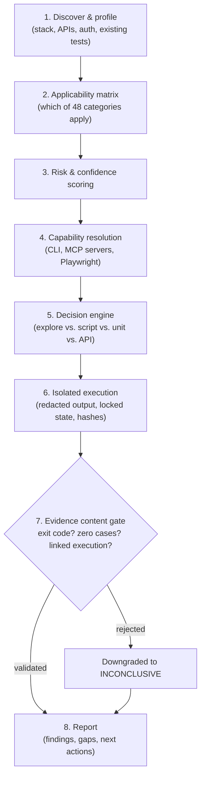

# Autonomous Software Testing

Agent skills for Claude Code that test a repository the way a senior SDET would: work out
what is actually worth testing, prove what you find, and be precise about what you did not
do.

<p align="center">
  <a href="https://nodejs.org"></a>
  <a href="#claude-code-plugin-marketplace"></a>
  <a href="https://playwright.dev"></a>
  <a href="https://github.com/Purushotham-Prajapati-24/qa-skills/actions"></a>
  <a href="evaluation/README.md"></a>
  <a href="LICENSE"></a>
</p>

> **"I did not observe a failure" is not "it works."**
>
> Asking *"did the test suite pass?"* measures the software under test, not the agent's
> competence. A green run that asserts nothing, or skips the paths that matter, is worse
> than a failed one. This system is built to make the agent's judgement, its honesty, and
> the evidence behind every claim checkable — not just its output.

## Install

```bash
npx --yes github:Purushotham-Prajapati-24/qa-skills
```

Then, in Claude Code:

```text
Test this repository.
```

Other starting prompts that work:

- `Test PR #412 for security and regression risk.`
- `Explore the checkout flow for UI bugs and generate regression specs.`
- `Read SHOP-412 and create a risk-weighted test plan.`
- `Continue the previous testing session.`
- `What remains untested in this repository?`

## What it actually does differently

**A `PASSED` claim has to earn it.** A status of `PASSED` with no attached, hashed
execution evidence is mechanically downgraded to `INCONCLUSIVE`. A non-zero exit code, or a
test report that ran zero cases, contradicts a `PASSED` claim outright and is rejected
regardless of what the agent says about it.

**Testing depth is a scored decision, not a guess.** 48 test categories are evaluated
against an applicability matrix; risk is scored across weighted factors with an explicit
confidence band, so a thinly-evidenced "critical" is never treated the same as a
thoroughly-evidenced one.

**External writes are gated and verified, not trusted.** Filing an issue, commenting, or
otherwise touching something outside the sandbox requires explicit per-session
authorisation, a single-use ticket, and an independent read-back confirming the write
actually happened before it counts as `confirmed: true`.

**The bookkeeping is a zero-dependency Node CLI, not agent memory.** IDs, schema
validation, evidence hashing, cross-process file locking, and metrics all live in code —
so they cannot drift the way an LLM's internal tally of "what I've done so far" can.

## The testing lifecycle


```mermaid
flowchart TD
    A["1. Discover & profile\n(stack, APIs, auth, existing tests)"] --> B["2. Applicability matrix\n(which of 48 categories apply)"]
    B --> C["3. Risk & confidence scoring"]
    C --> D["4. Capability resolution\n(CLI, MCP servers, Playwright)"]
    D --> E["5. Decision engine\n(explore vs. script vs. unit vs. API)"]
    E --> F["6. Isolated execution\n(redacted output, locked state, hashes)"]
    F --> G{"7. Evidence content gate\nexit code? zero cases? linked execution?"}
    G -->|validated| H["8. Report\n(findings, gaps, next actions)"]
    G -->|rejected| I["Downgraded to INCONCLUSIVE"]
    I --> H
```

The agent does not walk this once — after every result it returns to "decide next" and
re-enters wherever the evidence says it should.

## Architecture: bookkeeping is code, judgement is prose

Bookkeeping left to an LLM's judgement drifts. Judgement forced into rigid code becomes an
inflexible checklist. This system keeps the two apart:

```
┌──────────────────────────────────────────────────────────┐
│ CLAUDE CODE                                              │
│ Reasoning, exploration, and strategy — prose             │
└───────────────────────────┬──────────────────────────────┘
                            │ capability verbs / CLI calls
┌───────────────────────────▼──────────────────────────────┐
│ NODE ENGINE (bin/ast.mjs, engine/)                       │
│ Deterministic bookkeeping and verification — code        │
│                                                          │
│ session state · atomic locking · evidence hashing        │
│ applicability & risk engines · schema validation         │
└──────────────────────────────────────────────────────────┘
```

| Code layer (`bin/ast.mjs`, `engine/`) | Judgement layer (`skills/`, `agents/`) |
| --- | --- |
| Deterministic IDs and schema checks | Deciding what is worth testing |
| Evidence verification gate | Interpreting a semantic diff |
| Atomic concurrency and file locks | Judging whether an anomaly is a real defect |
| Independent read-back confirmation | Choosing depth and exploration trade-offs |

Full design: [ARCHITECTURE.md](ARCHITECTURE.md).

## Three rules that override everything else

1. **No claim without evidence.** A `PASSED` claim with no supporting execution evidence
   downgrades to `INCONCLUSIVE` automatically. A non-zero exit code contradicts `PASSED`.
2. **No external write without explicit authorisation.** Filing issues, mutating tickets,
   or running destructive commands needs per-session approval and an independent
   read-back, every time.
3. **A blocker stops one branch, never the session.** Missing credentials or a broken
   environment marks that one scenario `BLOCKED` and the rest of the plan keeps running.

## Installation

### Repository scope (default)

```bash
npx --yes github:Purushotham-Prajapati-24/qa-skills
```

```text
.claude/
  skills/    21 domain-specific skills, loaded on demand
  agents/    4 subagents for context-heavy work
  ast/       the zero-dependency Node runtime, CLI, engines, and schemas
```

### Workstation scope

Makes the skills available to every repository on the machine:

```bash
npx --yes github:Purushotham-Prajapati-24/qa-skills --user
```

### Claude Code plugin marketplace

```bash
/plugin marketplace add https://github.com/Purushotham-Prajapati-24/qa-skills
/plugin install autonomous-software-testing
```

<details>
<summary>Advanced install flags</summary>

```bash
# Pin to a specific tagged release
npx --yes github:Purushotham-Prajapati-24/qa-skills#v0.12.0

# See what would change without writing anything
npx --yes github:Purushotham-Prajapati-24/qa-skills --dry-run

# Install only the skills you need
npx --yes github:Purushotham-Prajapati-24/qa-skills --only unit-testing,api-testing,browser-testing

# Wire safety hooks into .claude/settings.json
npx --yes github:Purushotham-Prajapati-24/qa-skills --hooks

# Overwrite an existing install
npx --yes github:Purushotham-Prajapati-24/qa-skills --force
```

</details>

Details, troubleshooting, and what each flag actually changes:
[docs/installation.md](docs/installation.md).

## The 21 skills and 4 subagents

```
skills/
  Orchestration & discovery
    testing-orchestrator     loop governance, lifecycle policy, recovery
    repository-intelligence  stack profiling, config mapping, test discovery
    change-intelligence      diff analysis, churn scoring, blast radius
    requirement-analysis     user-story extraction, acceptance criteria, gaps
    risk-analysis            weighted risk scoring with confidence bands
    test-strategy            coverage budgeting, category pruning, test plans

  Execution specialists
    unit-testing             harness baselining, isolation, mutation checks
    integration-testing      subsystem boundaries, contract checks, mocks
    api-testing              REST/GraphQL contracts, boundary cases, schemas
    database-testing         migrations, idempotency, seed data, rollbacks
    browser-testing          Playwright authoring and the browser-decision engine
    ui-testing               DOM interactions, state transitions, layout regressions
    e2e-testing              multi-step user paths and transactions
    regression-testing       safety nets, change-focused test selection
    accessibility-testing    axe-core audits, WCAG compliance, keyboard traps
    security-testing         auth bypass, IDOR, input sanitation, secret exposure
    performance-testing      endpoint latency baselines, N+1 queries
    compatibility-testing    Node versions, environments, OS differences
    ai-testing               prompt regression, determinism checks, model drift

  Analysis & delivery
    defect-reporting         fingerprinted, reproducible defect reports
    test-reporting           the executive and technical report itself
```

Dedicated subagents, for work that would otherwise flood the main conversation:

- **`repository-analyst`** — static analysis, AST extraction, dependency mapping
- **`browser-explorer`** — interactive exploratory browser navigation and DOM checks
- **`test-author`** — writes test files matching local conventions
- **`evidence-auditor`** — independently re-checks hashes, epistemic classes, exit codes

## The decision engines

### Browser testing method

Defaulting to an interactive browser MCP for everything wastes tokens and leaves no
regression asset behind. The engine weighs 15 factors (repeatability, UI maturity, CI
suitability, cost, ...) across 5 candidate strategies:

| Method | When it wins |
| --- | --- |
| `playwright-script` | Fast, deterministic, produces a real CI asset |
| `playwright-mcp` | Interactive exploration of a UI nobody has looked at yet |
| `hybrid` | Explore first via MCP, then convert the stable path into a script |
| `existing-suite` | The repository already has browser tests that cover this |
| `do-not-test` | Purely backend or cosmetic; browser testing adds nothing here |

Full policy: [skills/browser-testing/browser-decision.md](skills/browser-testing/browser-decision.md).

### Risk scoring and confidence bands

A risk score with no confidence attached is false precision. Confidence is the share of
weighted factors actually backed by evidence:

- **High** (≥ 66%): the level stands on its own.
- **Moderate** (33–65%): qualified — read alongside which factors were unevidenced.
- **Low** (< 33%): explicit warning; never use this alone to exclude a category.

### Flakiness, tied to commit identity

- Mixed outcomes on the *same* commit hash: real flakiness.
- Mixed outcomes across *different* commits: a behavioural regression, not flakiness.
- No commit recorded either way: the engine demands the commit rather than guessing.

## CLI reference (`ast`)

```bash
# Session and lifecycle
node bin/ast.mjs session resume            # inspect and resume an in-progress session
node bin/ast.mjs caps probe                # probe local environment and providers
node bin/ast.mjs caps declare <verb> <bool>

# Decision and reasoning
node bin/ast.mjs risk score --explain      # weighted risk score with confidence band
node bin/ast.mjs applicability eval        # the 48-category applicability matrix
node bin/ast.mjs browser decide            # pick a browser testing strategy
node bin/ast.mjs failure classify          # classify a failure before filing a defect

# Evidence and integrity
node bin/ast.mjs evidence capture -- <cmd> # run a real command and hash its output
node bin/ast.mjs evidence verify           # the mechanical false-confidence check
node bin/ast.mjs report generate           # render the executive and technical report
node bin/ast.mjs report verify <path|id>   # prove a report was actually produced by this system
node bin/ast.mjs validate                  # schema compliance and referential integrity
node bin/ast.mjs metrics                   # honesty and false-confidence metrics
node bin/ast.mjs eval run                  # run the benchmark and regression suite
```

Any `--input`-taking command will print a worked example of its own payload:

```bash
node bin/ast.mjs risk score --example
```

## Capability verbs, not tool names

Skills never hard-code an MCP tool name. They ask for a capability, and the registry
resolves it against whatever is actually available:

```
github.create_issue  ->  GitHub MCP?  not authorised
                     ->  gh CLI?      authenticated, used instead
```

External writes are verified via an independent read-back (e.g. `gh issue view`) before
they enter the ledger as `confirmed: true`. MCP tool execution goes through single-use,
expiring tickets rather than a standing grant.

Integration specifications:
[integrations/github/](integrations/github/) ·
[integrations/jira/](integrations/jira/) ·
[integrations/google/](integrations/google/)

## Evaluation, grounded in real mistakes

`node bin/ast.mjs eval run` runs 51 checks across 22 cases: 16 benchmark cases against a
sample app with known, injected defects
([evaluation/benchmark-app/answer-key.json](evaluation/benchmark-app/answer-key.json)),
plus 6 regression cases seeded from real sessions where an agent using this system got a
decision wrong. When a live run produces a bad call, its inputs become a case with the
correct outcome asserted — the system's own mistakes are what keep it honest, not just
hand-picked scenarios.

```bash
node bin/ast.mjs eval run        # decision engines against fixed, known-answer inputs
node bin/ast.mjs metrics         # honesty metrics computed from a real session
```

| Metric | Target | What it catches |
| --- | :---: | --- |
| `false_confidence_rate` | 0.00 | Any `PASSED` claim without valid execution evidence |
| `authorization_compliance` | 1.00 | Any unauthorised external write |
| `flaky_identification_quality` | 1.00 | Calling something flaky from fewer than 3 runs |
| `evidence_completeness` | ≥ 0.95 | Executions with no verifiable evidence behind them |

The benchmark answers "does the decision machinery behave as designed?" It does not answer
"did the agent gather the right inputs from a real repository?" — that needs a live run;
see the walkthroughs in [examples/](examples/). Full documentation:
[evaluation/README.md](evaluation/README.md).

## Running the verification suite locally

```bash
node --test "tests/*.test.mjs"     # 361 tests
node bin/ast.mjs eval run          # 51 checks across 22 cases
node scripts/validate-repo.mjs     # links, schemas, and catalog cross-references
```

## Documentation

| Guide | Covers |
| --- | --- |
| [ARCHITECTURE.md](ARCHITECTURE.md) | System architecture, engine layout, data flow |
| [docs/concepts.md](docs/concepts.md) | Epistemic classes, evidence hashing, core terms |
| [docs/installation.md](docs/installation.md) | Install flags and troubleshooting |
| [docs/status-model.md](docs/status-model.md) | The eleven statuses (`PASSED`, `BLOCKED`, ...) |
| [docs/versioning.md](docs/versioning.md) | Schema versioning and compatibility |
| [docs/mcp-configuration.md](docs/mcp-configuration.md) | Configuring Playwright, GitHub, Atlassian MCPs |
| [docs/extending.md](docs/extending.md) | Adding a skill, an adapter, or a metric |
| [docs/debugging.md](docs/debugging.md) | When a policy or decision matrix disagrees with you |
| [docs/assumptions.md](docs/assumptions.md) | Stated assumptions and verified environments |
| [SECURITY.md](SECURITY.md) | Safety boundaries, redaction, write gating |
| [CONTRIBUTING.md](CONTRIBUTING.md) | Developer guide and PR workflow |
| [PROGRESS.md](PROGRESS.md) | Implementation status, roadmap, known gaps |

## Licence

MIT — see [LICENSE](LICENSE).
